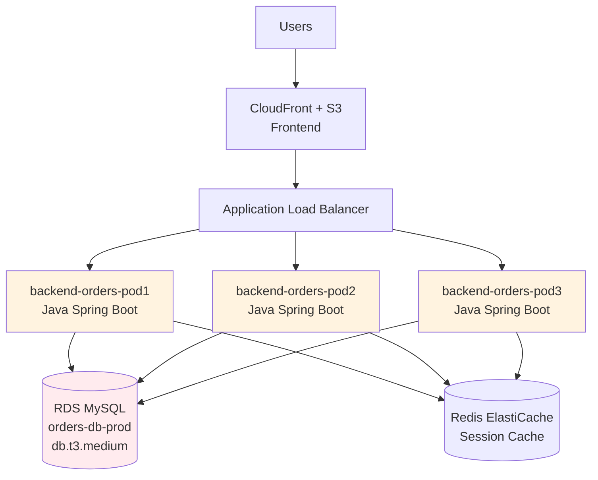
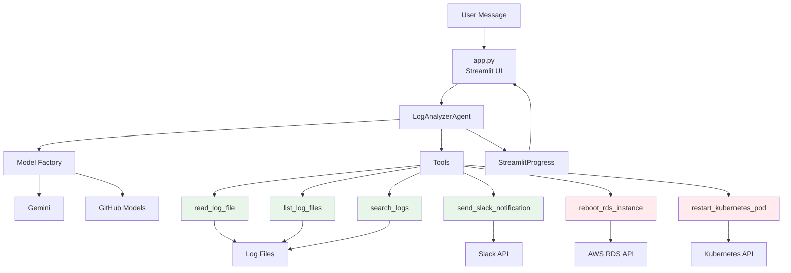
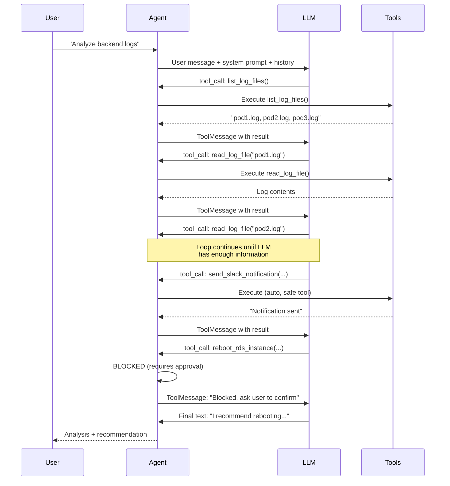
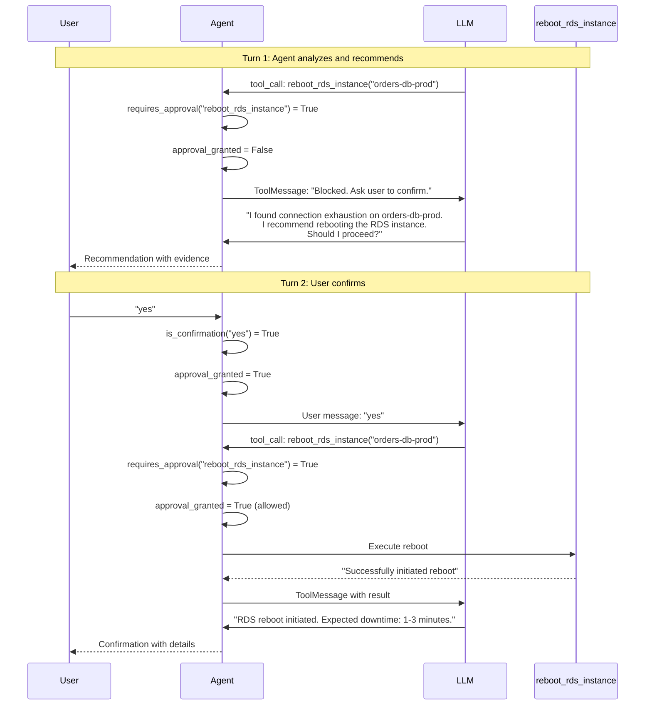

# Chapter 10: Building a Complex Agent with Actions

In Chapter 9, we built an agent that can restart a single Kubernetes pod using placeholder code. That was a good first step. But real production incidents don't involve one pod and one action. They involve multiple systems, cascading failures, and a sequence of coordinated responses.

This chapter puts you in a real scenario. Your three-tier AWS application is down. Backend pods are logging "Too many connections" errors. The database has exhausted its connection limit. Orders are failing. Customers are affected.

You need to analyze logs across multiple pods, diagnose the root cause, alert your team on Slack, reboot the RDS instance, and verify recovery.

We're going to build an agent that handles this entire workflow in a single conversation.

## The Scenario

You run a three-tier application on AWS:



- **Frontend**: CloudFront serving a React app from S3
- **Backend**: Three Java Spring Boot pods on EKS, behind an Application Load Balancer
- **Data layer**: RDS MySQL (`orders-db-prod`, db.t3.medium with 150 max connections) and Redis ElastiCache for session caching

Each pod runs a HikariCP connection pool with a max of 50 connections. Three pods × 50 connections = 150. That's exactly the RDS limit for a db.t3.medium instance.

When traffic spikes, all three pods max out their pools simultaneously. The database hits its connection ceiling. New connections get rejected. Orders fail. The health checks report degraded status. The entire order processing pipeline stalls.

This is a common failure mode in distributed systems. Connection pool sizing looks fine in isolation, but falls apart when every pod scales to its maximum.

## Project Structure

```
10/
├── app.py                      # Streamlit web interface
├── system_prompt.txt            # Agent persona and behavior
├── examples.txt                 # Incident resolution guidelines
├── requirements.txt
├── .env.example
├── Makefile
├── logs/                        # Simulated pod logs
│   ├── backend-orders-pod1.log
│   ├── backend-orders-pod2.log
│   └── backend-orders-pod3.log
└── src/
    ├── config.py                # Configuration management
    ├── models/
    │   ├── factory.py           # Provider selection
    │   ├── gemini.py            # Google Gemini wrapper
    │   └── github_openai.py     # GitHub Models wrapper
    ├── tools/
    │   ├── __init__.py          # Tool classification
    │   ├── log_reader.py        # Log file tools
    │   ├── actions.py           # Kubernetes actions
    │   ├── aws_actions.py       # RDS management
    │   └── slack_notifier.py    # Slack notifications
    ├── agents/
    │   └── log_analyzer.py      # Agent with tool-calling loop
    └── utils/
        └── response.py          # LLM response parsing
```

Here's how the components interact at runtime:



Green tools auto-execute. Red tools require human approval. That distinction drives the entire approval flow we'll build.

## The Log Files

Before building tools, let's look at what the agent will analyze. We have three log files simulating the connection exhaustion scenario.

Here's a condensed view of `backend-orders-pod1.log`:

```log
2024-02-06 09:00:00 INFO  [main] o.s.boot.SpringApplication - Starting OrderService v2.1.0 on backend-orders-6f8d7c4b5-n2k8p
2024-02-06 09:00:05 INFO  [main] com.zaxxer.hikari.HikariDataSource - HikariPool-1 - Starting...
2024-02-06 09:00:06 INFO  [main] com.zaxxer.hikari.HikariDataSource - HikariPool-1 - Start completed. Pool size: 10, Max pool size: 50
2024-02-06 09:00:08 INFO  [main] c.e.config.DatabaseConfig - Connected to RDS: orders-db.c9aksj2x.us-east-1.rds.amazonaws.com:3306/orders_prod
...
2024-02-06 10:00:00 WARN  [http-nio-8080-exec-8] com.zaxxer.hikari.pool.HikariPool - HikariPool-1 - Connection pool is nearing capacity (35/50 active connections)
2024-02-06 10:12:45 ERROR [http-nio-8080-exec-18] com.zaxxer.hikari.pool.HikariPool - HikariPool-1 - Connection is not available, request timed out after 30000ms
2024-02-06 10:12:45 ERROR [http-nio-8080-exec-18] c.e.service.OrderService - Failed to process order #ORD-2024-78234: Unable to acquire JDBC Connection
Caused by: java.sql.SQLNonTransientConnectionException: Data source rejected establishment of connection, message from server: "Too many connections"
...
2024-02-06 10:13:30 ERROR [connection-monitor] DATABASE CONNECTION EXHAUSTION DETECTED - RDS Instance: orders-db.c9aksj2x.us-east-1.rds.amazonaws.com
2024-02-06 10:13:30 ERROR [connection-monitor] Max connections: 150 (RDS db.t3.medium), Active: 150/150
2024-02-06 10:13:30 ERROR [connection-monitor] Total pods connected: 3 (pod1: 50, pod2: 50, pod3: 50)
2024-02-06 10:13:35 FATAL [main] c.e.OrderServiceApplication - Service is unable to serve requests. All database connections exhausted.
```

The pattern across all three pods is identical: pool fills up gradually, then errors cascade once the RDS limit is hit. The agent needs to read all three files and correlate the evidence—this isn't a single-pod issue, it's a system-wide failure.

## Building the Tools

### Tool Classification

The first design decision is which tools are safe to auto-execute and which need human approval. This classification is simple but critical:

```python
# src/tools/__init__.py

SAFE_TOOLS = {'read_log_file', 'list_log_files', 'search_logs', 'send_slack_notification'}
APPROVAL_REQUIRED_TOOLS = {'reboot_rds_instance', 'restart_kubernetes_pod'}


def requires_approval(tool_name: str) -> bool:
    """Check if a tool requires human approval before execution"""
    return tool_name in APPROVAL_REQUIRED_TOOLS
```

Reading logs can't break anything. Sending a Slack notification is informational. But rebooting a database drops all connections and causes downtime. Restarting a pod kills the running process. Those require a human to say "yes."

This is the same principle from Chapter 9, but now we have real tools behind it.

### AWS RDS Reboot Tool

This is the first tool in the series that talks to a real cloud API. It uses boto3 to reboot an RDS instance, with a fallback to placeholder mode when AWS credentials aren't configured:

```python
# src/tools/aws_actions.py

@tool
def reboot_rds_instance(db_instance_id: str, reason: str = "") -> str:
    """
    Reboot an AWS RDS database instance to reset connections and restore service.
    IMPORTANT: Always ask for user approval before using this tool. This will cause
    a brief service interruption (typically 1-3 minutes for a reboot).

    Use this when logs show "Too many connections" errors across multiple application pods,
    indicating the RDS instance has exhausted its connection limit.
    
    Args:
        db_instance_id: The RDS instance identifier (e.g., 'orders-db-prod')
        reason: Reason for the reboot (e.g., 'Connection pool exhaustion recovery')
    """
    if _is_aws_configured():
        return _reboot_rds_real(db_instance_id, reason)
    else:
        return _reboot_rds_placeholder(db_instance_id, reason)
```

The design pattern here matters. The tool function itself decides whether to call the real AWS API or simulate the action. The agent doesn't know the difference. It calls `reboot_rds_instance` either way. This lets you develop and test the entire workflow locally without AWS credentials, then flip a switch in production.

The real implementation checks the instance status before rebooting:

```python
def _reboot_rds_real(db_instance_id: str, reason: str) -> str:
    """Real AWS RDS reboot using boto3"""
    try:
        import boto3
        from botocore.exceptions import ClientError
        
        region = os.getenv('AWS_REGION', 'us-east-1')
        rds_client = boto3.client('rds', region_name=region)
        
        # Check instance status before rebooting
        response = rds_client.describe_db_instances(
            DBInstanceIdentifier=db_instance_id
        )
        instance = response['DBInstances'][0]
        status = instance['DBInstanceStatus']
        
        if status != 'available':
            return (
                f"Cannot reboot RDS instance '{db_instance_id}'. "
                f"Current status: {status}. Instance must be 'available' to reboot."
            )
        
        # Perform the reboot
        rds_client.reboot_db_instance(DBInstanceIdentifier=db_instance_id)
        
        return (
            f"Successfully initiated reboot of RDS instance '{db_instance_id}' "
            f"in region {region}.\n"
            f"Reason: {reason}\n"
            f"Expected downtime: 1-3 minutes.\n"
            f"All existing connections will be dropped and new connections "
            f"can be established after reboot."
        )
        
    except ClientError as e:
        return f"AWS API error: {e.response['Error']['Message']}"
```

Two things to notice. First, we check that the instance is `available` before trying to reboot. If it's already rebooting or in maintenance, we stop and tell the agent why. Second, the return message includes actionable information: expected downtime, what happens to connections, and what the application should do. The agent uses this information in its response to the user.

The placeholder version prints the equivalent AWS CLI command and returns a simulated success:

```python
def _reboot_rds_placeholder(db_instance_id: str, reason: str) -> str:
    """Placeholder RDS reboot for learning/testing"""
    region = os.getenv('AWS_REGION', 'us-east-1')
    
    print(f"\nPLACEHOLDER: Would reboot AWS RDS instance")
    print(f"Instance ID:      {db_instance_id}")
    print(f"Region:           {region}")
    print(f"AWS CLI command:  aws rds reboot-db-instance "
          f"--db-instance-identifier {db_instance_id}")
    
    return (
        f"[SIMULATED] Successfully initiated reboot of RDS instance "
        f"'{db_instance_id}' in region {region}.\n"
        f"Reason: {reason}\n"
        f"Expected downtime: 1-3 minutes.\n"
        f"All existing database connections will be dropped. "
        f"Application pods will reconnect automatically via HikariCP connection pool."
    )
```

This is useful for learning. You can run the full workflow, see exactly what would happen, and verify the agent's reasoning—without touching real infrastructure.

### Slack Notification Tool

The Slack tool sends structured incident reports to your team channel. Unlike the RDS tool, Slack notifications are classified as safe—they're informational and can't cause damage:

```python
# src/tools/slack_notifier.py

@tool
def send_slack_notification(
    channel: str,
    summary: str,
    severity: str = "P1",
    details: str = "",
    actions_taken: str = ""
) -> str:
    """
    Send an incident notification to a Slack channel with details about 
    the issue and actions taken.
    
    Args:
        channel: Slack channel name (e.g., '#devops-alerts')
        summary: Brief incident summary
        severity: Incident severity level ('P1', 'P2', 'P3', 'info')
        details: Detailed description of the issue and root cause
        actions_taken: Description of remediation actions that were executed
    """
    if _is_slack_configured():
        return _send_slack_real(channel, summary, severity, details, actions_taken)
    else:
        return _send_slack_placeholder(channel, summary, severity, details, actions_taken)
```

The real implementation builds a structured Slack message with Block Kit formatting—headers, sections, severity tags—and sends it via webhook. The placeholder version prints the payload to the console so you can verify the message format.

The tool description mentions "P1", "P2", "P3", and "info" severity levels. The agent picks the right severity based on what it finds in the logs. Connection exhaustion affecting all pods and causing order failures? That's P1. A slow query warning on one pod? That's P3.

### Registering Tools

All tools get registered in a single function. The agent calls this once during initialization:

```python
# src/tools/__init__.py

def get_all_tools():
    """Get all available tools for the agent"""
    tools = get_log_tools()               # read, list, search
    tools.append(restart_kubernetes_pod)   # requires approval
    tools.append(reboot_rds_instance)      # requires approval
    tools.append(send_slack_notification)  # safe
    return tools
```

Adding a new tool is straightforward: write the function, decorate it with `@tool`, add it to `get_all_tools()`, and decide whether it goes in `SAFE_TOOLS` or `APPROVAL_REQUIRED_TOOLS`. The agent learns about it from the tool's docstring. No changes to the agent logic.

## The Model Factory

In Chapter 9, we only supported Gemini. That's limiting. Different teams use different providers. Some organizations can't send data to Google. Others have GitHub Copilot subscriptions with model access.

The model factory lets you switch providers with a single environment variable:

```python
# src/models/factory.py

def create_model():
    """Instantiate and return the configured LLM model."""
    provider = Config.LLM_PROVIDER

    if provider == "gemini":
        from .gemini import GeminiModel
        return GeminiModel()

    if provider == "github":
        from .github_openai import GitHubModel
        return GitHubModel()

    raise ValueError(
        f"Unknown LLM_PROVIDER '{provider}'. "
        "Supported values: gemini, github"
    )
```

Each model wrapper is a thin class that initializes the LLM and exposes `get_llm_with_tools()`:

```python
# src/models/gemini.py

class GeminiModel:
    def __init__(self):
        self.llm = ChatGoogleGenerativeAI(
            model=Config.GEMINI_MODEL,
            google_api_key=Config.GEMINI_API_KEY,
            temperature=Config.TEMPERATURE
        )

    def get_llm_with_tools(self, tools: list):
        return self.llm.bind_tools(tools)
```

```python
# src/models/github_openai.py

class GitHubModel:
    def __init__(self):
        self.llm = ChatOpenAI(
            model=Config.GITHUB_MODEL,
            api_key=Config.GITHUB_TOKEN,
            base_url=Config.GITHUB_ENDPOINT,
            temperature=Config.TEMPERATURE,
        )

    def get_llm_with_tools(self, tools: list):
        return self.llm.bind_tools(tools)
```

Both follow the same interface: `__init__` sets up the LLM, `get_llm_with_tools` binds tools to it. The agent doesn't care which one it gets. It calls `create_model()` and works with whatever comes back.

To switch from Gemini to GitHub Models, change one line in your `.env`:

```dotenv
LLM_PROVIDER=github
GITHUB_TOKEN=your_token_here
GITHUB_MODEL=openai/gpt-4.1
```

The GitHub Models endpoint is OpenAI-compatible, so we use `ChatOpenAI` from `langchain-openai` with a custom `base_url`. This is a pattern you'll see frequently—many AI providers expose OpenAI-compatible APIs.

## The Agent

This is the core of the chapter. The `LogAnalyzerAgent` manages the conversation, executes tool calls, and handles the approval flow.

### The Tool-Calling Loop

LLMs with tool-calling don't just give you text. They return structured instructions: "call this function with these arguments." Your code executes the function, sends the result back, and the LLM decides what to do next. This continues until the LLM produces a final text answer.

Here's the flow:



The agent doesn't control which tools the LLM calls or in what order. It controls what happens when a tool call arrives. Safe tools execute immediately. Dangerous tools get blocked.

### Implementation

```python
# src/agents/log_analyzer.py

CONFIRMATIONS = {
    "yes", "y", "confirm", "approve", "go ahead",
    "do it", "ok", "proceed", "sure", "yeah", "yep",
}


def is_confirmation(text: str) -> bool:
    """Return True if the text is a short user confirmation."""
    return text.strip().lower().rstrip("!.,") in CONFIRMATIONS
```

The `is_confirmation()` function lives at module level, not inside the agent class. It's a pure function—takes a string, returns a boolean. We define the confirmation words as a set so lookup is fast and the list is easy to extend.

The agent class has three methods: `process_query`, `_tool_loop`, and `_execute_tool_call`.

```python
class LogAnalyzerAgent:
    def __init__(self):
        self.model = create_model()
        self.tools = get_all_tools()
        self.llm = self.model.get_llm_with_tools(self.tools)
        self.prompt = ChatPromptTemplate.from_messages([
            ("system", Config.get_system_prompt()),
            MessagesPlaceholder(variable_name="chat_history"),
            ("user", "{input}"),
        ])
```

The prompt template uses `MessagesPlaceholder` for chat history. This means the agent receives the full conversation—every previous question and answer—as context. The LLM sees what tools it called before, what the user said, and what it recommended. When the user says "yes" to confirm an action, the LLM knows what it's confirming because the recommendation is right there in the history.

### Process Query

```python
def process_query(self, user_input: str, chat_history: list = None,
                  callbacks=None) -> str:
    chat_history = chat_history or []

    # Should we let infrastructure tools through this turn?
    approval_granted = is_confirmation(user_input)

    messages = self.prompt.format_messages(
        chat_history=chat_history, input=user_input,
    )

    if callbacks:
        callbacks.on_thinking()

    response = self.llm.invoke(messages)
    return self._tool_loop(response, messages, approval_granted, callbacks)
```

The critical line is `approval_granted = is_confirmation(user_input)`. The agent checks if the user's message is a confirmation before doing anything else. If the user typed "yes", every infrastructure tool call in this turn gets allowed through.

This is a deliberate design choice. The approval check happens inside the agent, not in the UI. The UI doesn't need to know about tool classification or approval logic. It just sends the user's message and gets a response. This separation means you can swap Streamlit for a CLI, an API endpoint, or a Slack bot without touching the approval mechanism.

### The Tool Loop

```python
def _tool_loop(self, response, messages: list,
               approval_granted: bool, callbacks) -> str:
    last_text = ""

    for _ in range(Config.MAX_ITERATIONS):
        # No tool calls -> return the final answer
        if not getattr(response, "tool_calls", None):
            text = extract_response_text(response)
            return text or last_text or "No response generated."

        # Keep any intermediate text
        intermediate = extract_response_text(response)
        if intermediate:
            last_text = intermediate

        if callbacks and intermediate:
            callbacks.on_reasoning(intermediate)

        # Execute each tool call
        tool_results = []
        for tc in response.tool_calls:
            result_msg = self._execute_tool_call(
                tc, approval_granted, callbacks,
            )
            tool_results.append(result_msg)

        # Feed results back to the LLM
        messages.append(AIMessage(
            content=response.content,
            tool_calls=response.tool_calls,
        ))
        messages.extend(tool_results)

        if callbacks:
            callbacks.on_thinking()

        response = self.llm.invoke(messages)

    # Exhausted iterations
    text = extract_response_text(response)
    return text or last_text or "Reached maximum analysis steps."
```

This loop does three things:

1. Check if the LLM returned tool calls. If not, we have the final answer.
2. Execute each tool call and collect results as `ToolMessage` objects.
3. Append everything to the message list and send it back to the LLM.

The `MAX_ITERATIONS` guard prevents infinite loops. If the LLM keeps calling tools without converging on an answer, we stop after 10 iterations and return whatever text we have.

Notice how we save `intermediate` text. Some LLMs return both text and tool calls in the same response—a sentence of reasoning alongside a tool invocation. We capture that text and show it in the UI as reasoning steps. If the final response is empty (which can happen with certain providers), we fall back to the last intermediate text.

### Execute Tool Call

```python
def _execute_tool_call(self, tc: dict, approval_granted: bool,
                       callbacks) -> ToolMessage:
    name, args, call_id = tc["name"], tc["args"], tc["id"]

    # Block infrastructure tools until user confirms
    if requires_approval(name) and not approval_granted:
        if callbacks:
            callbacks.on_approval_skipped(name, args)
        return ToolMessage(
            content=(
                f"Action '{name}' requires human approval and was not executed. "
                "Present your findings and ask the user to confirm. "
                "When the user confirms, call this tool again -- "
                "the system will allow it through."
            ),
            tool_call_id=call_id,
        )

    # Execute the tool
    if callbacks:
        callbacks.on_tool_start(name, args)

    tool_func = self._find_tool(name)
    if not tool_func:
        return ToolMessage(content=f"Tool '{name}' not found",
                           tool_call_id=call_id)

    try:
        result = str(tool_func.invoke(args))
        if callbacks:
            callbacks.on_tool_end(name, result, success=True)
        return ToolMessage(content=result, tool_call_id=call_id)
    except Exception as e:
        if callbacks:
            callbacks.on_tool_end(name, str(e), success=False)
        return ToolMessage(content=f"Error: {e}", tool_call_id=call_id)
```

This is where the approval flow actually happens. When the agent wants to call `reboot_rds_instance` and `approval_granted` is `False`, it returns a `ToolMessage` that tells the LLM two things: the action was blocked, and it should ask the user to confirm and then call the tool again.

That second part is crucial. Without it, the LLM would just report "the action was blocked" and stop. With it, the LLM understands it's in a workflow: present findings, get approval, retry. When the user says "yes" on the next turn, `is_confirmation("yes")` returns `True`, `approval_granted` is `True`, and the `requires_approval` check passes.

Here's the full approval flow:



The beauty of this design is that the LLM handles the conversation naturally. It doesn't need special instructions for every tool. The system tells it "this was blocked, ask for confirmation" and the LLM figures out how to present that to the user.

## The System Prompt

The system prompt defines who the agent is and how it behaves. We keep it in an external file (`system_prompt.txt`) so you can tune it without changing code:

```text
You are a senior DevOps engineer AI agent. You think and act like an experienced
on-call engineer: read logs, correlate evidence across systems, diagnose root
causes, take action, and communicate clearly.

You are monitoring a three-tier AWS application: Java Spring Boot backend on EKS,
RDS MySQL, Redis ElastiCache, CloudFront + S3 frontend.

Act through tools -- don't just describe what you would do. When you identify an
issue, call the relevant tools directly. The system will auto-execute safe actions
and block infrastructure changes until the user confirms.

Be concise, specific, and evidence-driven. Include instance IDs, pod names,
timestamps, and error counts. Only state what the logs show -- if something is
unclear, say so.
```

Four paragraphs, four purposes:

1. **Identity**: The agent is a senior DevOps engineer. This framing gives the LLM the right behavioral context—it should think like someone who's been paged at 2 AM, not like a general-purpose assistant.

2. **Context**: The specific infrastructure it's monitoring. Without this, the LLM would guess at architecture details.

3. **Action bias**: "Act through tools" is essential. Without it, the LLM tends to describe what it would do rather than actually calling tools. This nudge forces it to use the tools it has.

4. **Communication style**: Evidence-driven, specific, concise. No filler. This prevents the LLM from generating lengthy, vague analysis.

### Incident Resolution Guidelines

The `examples.txt` file provides behavioral guidelines that get appended to the system prompt:

```text
INCIDENT RESOLUTION GUIDELINES:

1. Gather evidence efficiently.
   Read full log contents rather than running many individual searches.
   Read all available logs before drawing conclusions.

2. Alert the team when you have a diagnosis.
   Once you have enough evidence, alert the team with severity, affected
   systems, root cause, and impact. Alert before proposing infrastructure
   remediation.

3. Remediate with the smallest effective action.
   After alerting, choose the least disruptive fix. Infrastructure changes
   are blocked the first time -- present your recommendation and ask the
   user to confirm. When the user says yes, call the same action again.

4. Verify and follow up.
   After remediation executes, notify the team of the outcome.

5. Communicate with evidence, not assumptions.
   Cite specific timestamps, error messages, pod names, and instance IDs.
```

These guidelines shape the agent's workflow without being rigid scripts. Guideline 2 says "alert before proposing infrastructure remediation"—this ensures the team knows about the incident before you start rebooting databases. Guideline 3 says "call the same action again"—this teaches the LLM the re-invocation pattern for the approval flow.

The separation between `system_prompt.txt` and `examples.txt` is intentional. The system prompt defines the agent's identity and context. The examples define operational procedures. You can update procedures without changing the agent's persona.

## Configuration

The `Config` class manages all environment variables in one place:

```python
# src/config.py

class Config:
    # LLM Provider selection: 'gemini' (default) or 'github'
    LLM_PROVIDER = os.getenv('LLM_PROVIDER', 'gemini').lower()
    
    # Gemini
    GEMINI_API_KEY = os.getenv('GEMINI_API_KEY')
    GEMINI_MODEL = os.getenv('GEMINI_MODEL', 'gemini-2.5-flash')
    
    # GitHub Models
    GITHUB_TOKEN = os.getenv('GITHUB_TOKEN', '')
    GITHUB_MODEL = os.getenv('GITHUB_MODEL', 'openai/gpt-5')
    GITHUB_ENDPOINT = os.getenv('GITHUB_ENDPOINT', 'https://models.github.ai/inference')
    
    # AWS
    AWS_REGION = os.getenv('AWS_REGION', 'us-east-1')
    AWS_RDS_INSTANCE_ID = os.getenv('AWS_RDS_INSTANCE_ID', '')
    
    # Slack
    SLACK_WEBHOOK_URL = os.getenv('SLACK_WEBHOOK_URL', '')
    SLACK_CHANNEL = os.getenv('SLACK_CHANNEL', '#devops-alerts')
    
    # Agent
    MAX_ITERATIONS = 10
    TEMPERATURE = float(os.getenv('TEMPERATURE', '0.1'))
```

The `validate()` method checks that the selected provider has the required credentials:

```python
@classmethod
def validate(cls):
    if cls.LLM_PROVIDER == 'gemini' and not cls.GEMINI_API_KEY:
        raise ValueError(
            "LLM_PROVIDER=gemini but GEMINI_API_KEY is not set."
        )
    if cls.LLM_PROVIDER == 'github' and not cls.GITHUB_TOKEN:
        raise ValueError(
            "LLM_PROVIDER=github but GITHUB_TOKEN is not set."
        )
```

AWS and Slack are optional. If they're not configured, the tools fall back to placeholder mode. This means you can run the agent without any cloud credentials and still see the complete workflow.

The `get_system_prompt()` method loads the prompt from files:

```python
@classmethod
def get_system_prompt(cls) -> str:
    base_dir = os.path.dirname(os.path.dirname(__file__))
    
    with open(os.path.join(base_dir, 'system_prompt.txt'), 'r') as f:
        prompt = f.read()
    
    examples_file = os.path.join(base_dir, 'examples.txt')
    try:
        with open(examples_file, 'r') as f:
            prompt += '\n\n' + f.read()
    except FileNotFoundError:
        pass  # examples are optional
    
    return prompt
```

The system prompt is required—the agent won't start without it. The examples file is optional, appended if present. This gives you flexibility: you can start with just the persona and add behavioral guidelines later.

## The Web Interface

The Streamlit UI from Chapter 8 stays the same in structure. The main change is adding real-time progress feedback so users can see what the agent is doing while it works.

### StreamlitProgress

The `StreamlitProgress` class provides callbacks that the agent calls during execution. Each callback updates a `st.status` container in real time:

```python
TOOL_LABELS = {
    "list_log_files":          "Listing log files",
    "read_log_file":           "Reading log file",
    "search_logs":             "Searching logs",
    "reboot_rds_instance":     "Rebooting RDS instance",
    "restart_kubernetes_pod":  "Restarting Kubernetes pod",
    "send_slack_notification": "Sending Slack notification",
}


class StreamlitProgress:
    def __init__(self, container):
        self.status = container
        self.tool_count = 0
        self.steps = []

    def on_thinking(self):
        self.status.update(label="Thinking...", state="running")

    def on_reasoning(self, text: str):
        if text:
            self.status.write(f"_{text}_")
            self.steps.append({"label": "Reasoning", "detail": text})

    def on_tool_start(self, tool_name: str, tool_args: dict):
        self.tool_count += 1
        label = TOOL_LABELS.get(tool_name, tool_name)
        self.status.update(label=f"{label}...", state="running")

    def on_tool_end(self, tool_name: str, result: str, success: bool = True):
        label = TOOL_LABELS.get(tool_name, tool_name)
        marker = "OK" if success else "FAIL"
        preview = _summarize_result(tool_name, result)
        self.status.write(f"[{marker}] **{label}** — {preview}")
        self.steps.append({"label": label, "detail": f"[{marker}] {preview}"})

    def on_approval_skipped(self, tool_name: str, tool_args: dict):
        label = TOOL_LABELS.get(tool_name, tool_name)
        self.status.write(f"[BLOCKED] **{label}** — requires your approval")
        self.steps.append({"label": label, "detail": "[BLOCKED] requires approval"})

    def complete(self):
        n = self.tool_count
        if n:
            self.status.update(
                label=f"Done — {n} tool{'s' if n != 1 else ''} used",
                state="complete", expanded=False,
            )
        else:
            self.status.update(label="Done", state="complete", expanded=False)
```

The `TOOL_LABELS` dictionary maps internal tool names to human-readable descriptions. Users don't need to see `read_log_file`—they see "Reading log file."

Each callback records a step in `self.steps`. These steps are saved into the message history and rendered as a collapsible expander when the conversation is replayed. So when you scroll back through a conversation, you can expand any assistant message and see exactly which tools were used and what they returned.

The `_summarize_result()` function creates a one-line preview for each tool result:

```python
def _summarize_result(tool_name: str, result: str) -> str:
    r = str(result)
    if tool_name == "list_log_files":
        count = r.count(".log")
        return f"found {count} log file{'s' if count != 1 else ''}"
    if tool_name == "read_log_file":
        return "file read"
    if tool_name == "search_logs":
        first_line = r.split("\n")[0]
        return first_line.lower() if "Found" in first_line else "search complete"
    if tool_name == "send_slack_notification":
        return "notification sent"
    if tool_name in ("reboot_rds_instance", "restart_kubernetes_pod"):
        return "initiated"
    return r[:80]
```

Log file contents can be hundreds of lines. You don't want that in the progress panel. "file read" is enough to know the step succeeded.

### The Main Loop

The main application logic is straightforward:

```python
def main():
    init_session()
    sidebar()

    st.info("**Try:** *Analyze backend pod logs and detect issues*")
    display_history()

    if prompt := st.chat_input("Ask about backend logs..."):
        st.session_state.messages.append({"role": "user", "content": prompt})
        with st.chat_message("user"):
            st.markdown(prompt)

        with st.chat_message("assistant"):
            status = st.status("Analyzing...", expanded=True)
            progress = StreamlitProgress(status)
            history = to_langchain(st.session_state.messages[:-1])

            try:
                response = st.session_state.agent.process_query(
                    user_input=prompt,
                    chat_history=history,
                    callbacks=progress,
                )
                progress.complete()
            except Exception as e:
                progress.error(str(e))
                response = f"Error: {e}"

            st.markdown(response)

        st.session_state.messages.append({
            "role": "assistant",
            "content": response,
            "steps": progress.steps,
        })
```

The flow is: save the user's message, create a progress container, convert the history to LangChain format, call the agent, render the response. Each assistant message includes the thinking steps so they can be replayed.

Notice `to_langchain(st.session_state.messages[:-1])`. We convert all messages except the last one (which is the current user message—the agent receives that as `user_input`). This prevents duplication.

## Response Parsing

Different LLM providers return responses in different formats. Gemini might return a string. GitHub Models might return a list of content blocks. The `extract_response_text()` utility handles all cases:

```python
# src/utils/response.py

def extract_response_text(response) -> str:
    text = ""
    
    if hasattr(response, 'content'):
        content = response.content
        
        if isinstance(content, str):
            text = content
        elif isinstance(content, list):
            text_parts = []
            for block in content:
                if isinstance(block, dict) and 'text' in block:
                    text_parts.append(block['text'])
                elif isinstance(block, str):
                    text_parts.append(block)
            text = '\n'.join(text_parts)
    else:
        text = str(response)
    
    return text.strip()
```

This function gets called on every LLM response. It's defensive—it handles strings, lists, dictionaries, and anything else by converting to string as a fallback. Without it, you'd get crashes when switching between providers that format responses differently.

## Running the Agent

### Setup

1. Clone the repository and navigate to the chapter directory:

```bash
cd 03-ai-agent-for-devops/code/10
```

2. Create a virtual environment and install dependencies:

```bash
python -m venv .venv
source .venv/bin/activate
pip install -r requirements.txt
```

3. Copy the environment template and add your API key:

```bash
cp .env.example .env
```

Edit `.env` with your preferred provider:

```dotenv
# Option A: Google Gemini
LLM_PROVIDER=gemini
GEMINI_API_KEY=your_api_key_here

# Option B: GitHub Models
# LLM_PROVIDER=github
# GITHUB_TOKEN=your_github_token_here
# GITHUB_MODEL=openai/gpt-4.1
```

4. Start the application:

```bash
make run
# or: streamlit run app.py
```

### What Happens Without AWS Credentials

If you don't have AWS configured, the workflow is identical. The only difference is the RDS tool prints "PLACEHOLDER" to your terminal and returns a simulated success. The agent's reasoning, the Slack notification, and the approval flow all work the same way. This is by design—you can learn the full workflow locally and add real credentials later.

## Key Design Decisions

Looking back at this chapter, three design decisions shaped the entire implementation:

### 1. Approval Lives in the Agent

The UI doesn't know which tools are safe and which aren't. The agent makes that decision. This means you can put any frontend on top—Streamlit, a REST API, a Slack bot—and the safety mechanisms travel with the agent.

### 2. The LLM Drives the Workflow

We don't hard-code the sequence of tool calls. The LLM reads the logs, decides it needs to alert the team, decides the database needs a reboot, and asks for permission. If you add a new tool tomorrow, the LLM can start using it without you changing the agent code. This is the tool use pattern from Chapter 10 in the book—the agent picks the right tool for the situation.

### 3. Placeholder Mode Is a Feature

Real/placeholder duality in every external tool means you can develop and test the full workflow without cloud credentials. The agent's reasoning doesn't change. The approval flow doesn't change. Only the final API call differs. When you're ready for production, you configure the credentials and the tools switch to real mode automatically.

## What You've Learned

You started this chapter with a single-tool, placeholder-only agent. Now you have a system that:

- Reads and correlates logs across multiple pods
- Detects patterns like connection pool exhaustion
- Sends structured Slack alerts with severity and evidence
- Reboots AWS RDS instances with proper status checking
- Blocks dangerous operations until a human confirms
- Shows real-time progress as each tool executes
- Supports multiple LLM providers through a factory pattern
- Works locally with placeholders and in production with real APIs

The agent's architecture follows a clean separation: the UI handles display, the agent handles logic, the tools handle execution, and the config handles environment. Each layer can change independently.

More importantly, you've seen how to build an approval flow that works within LLM tool-calling. The pattern—block on first call, send a message telling the LLM to retry, detect the user's confirmation, allow on second call—is reusable. Every new infrastructure tool you add automatically gets the same safety mechanism just by adding its name to `APPROVAL_REQUIRED_TOOLS`.

## What's Next

You have a working agent with real tools and a clean approval flow. But it forgets everything between sessions. If the same database connection issue happened last week, the agent has no memory of it.

In **Chapter 11: Memory and State Management**, you'll add persistence to the agent. It will remember past incidents, track recurring patterns, and learn from previous investigations. You'll implement LangChain's memory systems and build a storage layer that survives restarts.

The agent knows how to act. Next, it learns how to remember.
